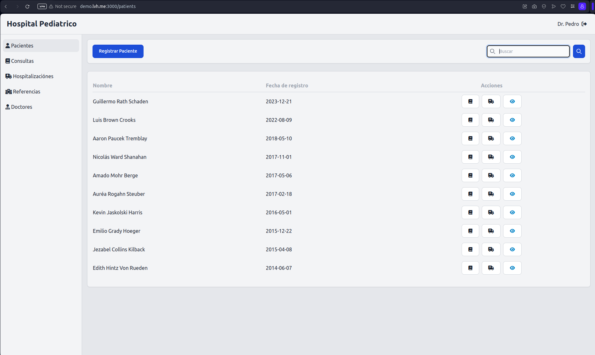

# ASISTENCIA CLINICA

[](https://codeclimate.com/github/JuanVqz/doctors/maintainability)
[](https://github.com/JuanVqz/doctors/actions/workflows/tests.yml)
[](https://github.com/testdouble/standard)


Es un sistema donde las instituciones clinicas podran registrar doctores para
tomar consultas de los pacientes y conservar el historial clinico.



## Requisitos

- ruby 3.2.2
- rails 7.0.7.2
- postgres 13
- node 20.8.0

## Instalación

Es necesario utilizar `lvh.me:300` para ingresar a los subdominio desde el ambiente
de desarrollo, si ejecuta las semillas existe un subdominio `demo`
y debes ingresar de la siguiente manera.

```sh
git clone https://github.com/JuanVqz/doctors.git
cd doctors

# con docker
docker-compose run --rm web rails db:setup
docker-compose up

# ó local
./bin/setup
./bin/dev
```

ahora puedes visitar la siguiente ruta

```bash
http://demo.lvh.me:3000
```

e iniciar sesión con el doctor (administrador)

```
usuario: cero@gmail.com
contraseña: 123456
```

## Build next rails config

```
docker-compose build --build-arg BUNDLE_GEMFILE=Gemfile.next next
docker-compose up next
docker-compose run --rm next bash
```

## Deploy

### Reiniciar base de datos | Warning: Perderá toda la información

```bash
heroku restart; heroku pg:reset DATABASE --confirm heroku_doctors;
heroku run rails db:migrate
heroku run rails db:seed
heroku run rails console
```

## Desarrollo

Si esta interesado en contribuir al desarrollo comprando un subdominio
puede [contactarnos.](https://github.com/JuanVqz)

## Deprecado

#### Deploy

Antes de realizar el deploy puedes verificar los requisitos con:

```sh
cap production deploy:check
```

Comandos para realizar deploy con capistrano:

```sh
cap production deploy
```

Despues de realizar el deploy, tienes que reiniciar unicorn con el comando siguiente:

```sh
cap production unicorn:start
```
